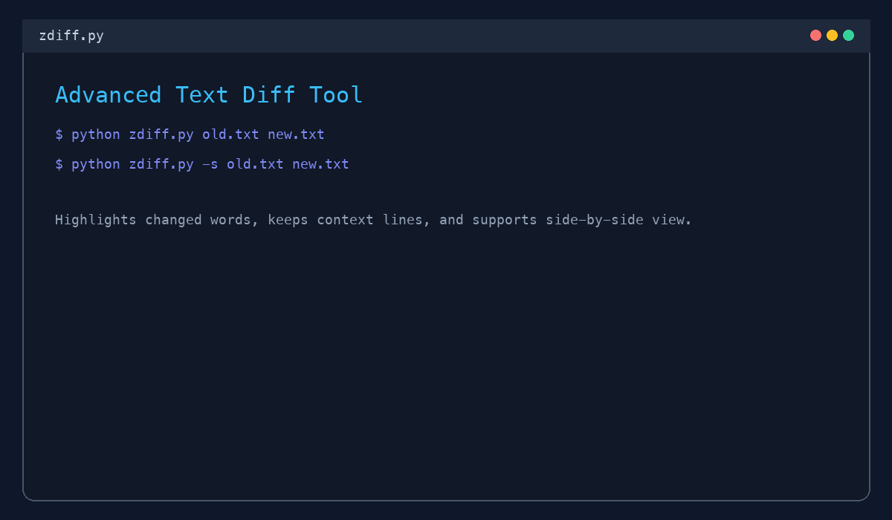

# zdiff.py - Advanced Text Diff Tool

[](https://github.com/example/zdiff)
[](https://python.org)
[](LICENSE)

A professional diff tool with git-style output and precise word-level highlighting. It emphasizes only changed tokens in both single-column and side-by-side views for clear, review-friendly text/code comparison.



## ✨ Features

- **🎯 Git-style diff output** - Professional formatting with file headers, hunk headers, and line numbers
- **🔎 Word-level highlighting** - Highlights only affected words/tokens instead of whole lines
- **🔗 Consecutive block merging** - Adjacent changed words form continuous highlight blocks
- **🪟 Side-by-side mode** - Compare file1 (left) and file2 (right) with line numbers in both panels

## 🚀 Quick Start

Requirements: Python 3.6+ and no extra dependencies.

```bash
# from repo root
python zdiff.py file1.txt file2.txt
python zdiff.py -s file1.txt file2.txt
python zdiff.py -c 5 file1.txt file2.txt
python zdiff.py --help

# optional executable mode
chmod +x zdiff.py
./zdiff.py file1.txt file2.txt
```

CLI synopsis:

```text
usage: zdiff.py [-h] [--context CONTEXT] [--side-by-side] file1 file2
```

Exit codes:

- `0` - Files are identical
- `1` - Files differ (normal case)
- `2` - Error occurred (file not found, etc.)

## 🎨 Output Examples

### Standard Diff Output

```diff
--- file1.txt
+++ file2.txt
@@ -1,14 +1,14 @@
   1  Case 01 unchanged: Keep this line.
-  2  Case 02 replace: status=old
+  2  Case 02 replace: status=new
-  3  Case 03 word scope: alpha beta gamma
+  3  Case 03 word scope: alpha delta gamma
-  4  Case 04 insert-in-line: route=/api/v1
+  4  Case 04 insert-in-line: route=/api/v1?sort=desc
-  5  Case 05 delete-in-line: remove this marker now
+  5  Case 05 delete-in-line: remove marker now
-  6  Case 06 mixed: Drift: alpha beta gamma delta epsilon zeta eta theta.
+  6  Case 06 mixed: Drift: alpha gamma delta extra epsilon eta theta iota.
-  7  Case 07 pure line deletion: Line delete only: remove me.
   8  Case 07/08 shared anchor: keep this line.
+  8  Case 08 pure line insertion: Line insert only: add me.
-  9  Case 09 whitespace-only: Whitespace: key=[   ]
+  9  Case 09 whitespace-only: Whitespace: key=[  ]
- 10  Case 10 unicode/emoji: version=甲, stage-A 🙂
+ 10  Case 10 unicode/emoji: version=乙, stage-B 🙂
- 11  Case 11 long-line clipping: Long: old token token token token token token token token end
+ 11  Case 11 long-line clipping: Long: new token token token token token token token token end
  12  Case 12 context A
- 13  Case 12 context change: change-old
+ 13  Case 12 context change: change-new
  14  Case 12 context B
```

### zdiff Output

Each rule below uses a one-line minimal `before => after` example (validated against current `zdiff` output):
Rules 1-12 map directly to the lines in the Standard Diff Output block above; rules 13-14 are special standalone outcomes.

<code><span style="background:#ffd6db;padding:0 2px;border-radius:3px;">old-side changed text</span></code>
<code><span style="background:#c9f7d8;padding:0 2px;border-radius:3px;">new-side changed text</span></code>

#### 1) Unchanged line
<code>Keep this line.</code> => <code>Keep this line.</code> (no highlight on either side).

#### 2) Replace (single-column and -s)
<code>status=<span style="background:#ffd6db;padding:0 2px;border-radius:3px;">old</span></code> => <code>status=<span style="background:#c9f7d8;padding:0 2px;border-radius:3px;">new</span></code>.

#### 3) Word-level scope
<code>alpha <span style="background:#ffd6db;padding:0 2px;border-radius:3px;">beta</span> gamma</code> => <code>alpha <span style="background:#c9f7d8;padding:0 2px;border-radius:3px;">delta</span> gamma</code>.

#### 4) Insert-in-line
<code>route=/api/v1</code> => <code>route=/api/v1<span style="background:#c9f7d8;padding:0 2px;border-radius:3px;">?sort=desc</span></code>.

#### 5) Delete-in-line
<code>remove <span style="background:#ffd6db;padding:0 2px;border-radius:3px;">this</span> marker now</code> => <code>remove marker now</code>.

#### 6) Mixed delete+insert
<code>Drift: alpha <span style="background:#ffd6db;padding:0 2px;border-radius:3px;">beta</span> ... epsilon <span style="background:#ffd6db;padding:0 2px;border-radius:3px;">zeta</span> ...</code> => <code>Drift: alpha ... <span style="background:#c9f7d8;padding:0 2px;border-radius:3px;">extra</span> epsilon ... <span style="background:#c9f7d8;padding:0 2px;border-radius:3px;">iota</span> ...</code>.

#### 7) Pure line deletion
<code><span style="background:#ffd6db;padding:0 2px;border-radius:3px;">Line delete only: remove me.</span></code> => <code>&empty;</code>.

#### 8) Pure line insertion
<code>&empty;</code> => <code><span style="background:#c9f7d8;padding:0 2px;border-radius:3px;">Line insert only: add me.</span></code>.

#### 9) Whitespace-only change
<code>Whitespace: key=[␠␠<span style="background:#ffd6db;padding:0 2px;border-radius:3px;">␠</span>]</code> => <code>Whitespace: key=[␠␠]</code>.

#### 10) Unicode/emoji/punctuation
<code>版本=<span style="background:#ffd6db;padding:0 2px;border-radius:3px;">甲</span>, stage-<span style="background:#ffd6db;padding:0 2px;border-radius:3px;">A</span> 🙂</code> => <code>版本=<span style="background:#c9f7d8;padding:0 2px;border-radius:3px;">乙</span>, stage-<span style="background:#c9f7d8;padding:0 2px;border-radius:3px;">B</span> 🙂</code>.

#### 11) Long-line panel clipping
<code>Long: <span style="background:#ffd6db;padding:0 2px;border-radius:3px;">old</span> token token token ...</code> => <code>Long: <span style="background:#c9f7d8;padding:0 2px;border-radius:3px;">new</span> token token token ...</code>.

#### 12) Context around hunks
<code>A / <span style="background:#ffd6db;padding:0 2px;border-radius:3px;">change-old</span> / B</code> => <code>A / <span style="background:#c9f7d8;padding:0 2px;border-radius:3px;">change-new</span> / B</code>.

#### 13) No textual changes
<code>same</code> => <code>same</code> (prints <code>No changes detected</code>).

#### 14) EOF-newline-only difference
<code>tail&lt;no trailing newline&gt;</code> => <code>tail&lt;trailing newline&gt;</code> (prints explicit EOF newline difference block).

Visual preview page: `diff_highlighting_examples.html`

### Key Visual Features

- **Gray line numbers** for easy reference
- **Blue backgrounds** for deleted content with highlighted changed words
- **Green backgrounds** for added content with highlighted changed words
- **Consecutive highlighting** - Multiple adjacent changes appear as continuous blocks
- **Context lines** shown without highlighting for reference

## 🛠 Integration Examples

### Shell Scripts

```bash
#!/bin/bash
# Compare files and handle all zdiff exit codes (0/1/2)
python zdiff.py old_config.json new_config.json
rc=$?

case "$rc" in
  0) echo "Files are identical" ;;
  1) echo "Files differ" ;;
  2) echo "Error occurred (e.g., missing file)" >&2 ;;
esac

exit "$rc"
```

### Makefile Integration

```makefile
check-diff:
    python zdiff.py expected_output.txt actual_output.txt || exit 1

test: check-diff
    @echo "All tests passed"
```

### Git Alias

```bash
# Add to ~/.gitconfig
[alias]
    zdiff = !python /path/to/zdiff.py
```

## 📄 License

This project is licensed under the MIT License - see the [LICENSE](LICENSE) file for details.

**Made with ❤️ for developers who appreciate clean, readable diffs.**

---
